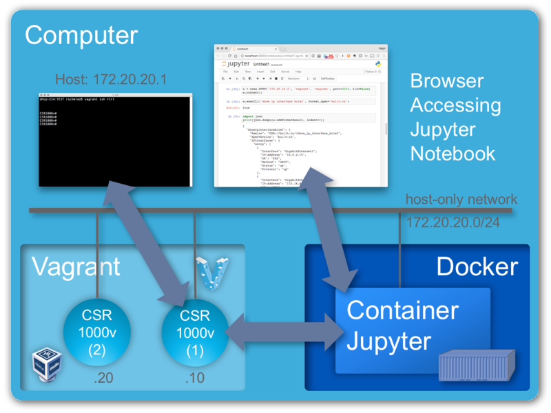

# README.md

This repository provides a framework for an interactive device programability learning class. It is intended to be used with individual workstations where each workstation hosts the complete environment consisting of

- 1-2 CSR1000V virtual routers running IOS XE 16.3.2 Denali. The platform for the virtual machines is Vagrant using the VirtualBox provider.
- Docker Container running Jupyter to serve the content notebooks with Python 3.5 as the kernel.

# Building the Environment
This is a rough guideline how to bring up / prepare the entire environment. It has a couple of dependencies:

- Git client
- VirtualBox 5.0.28
- Vagrant 1.8.7 (be aware of [this issue](https://github.com/mitchellh/vagrant/issues/7970))
- Docker 1.12.3
- cdrtools (in particular `mkisofs`)
- a build environment (e.g. compiler, make, ...), suggest to use MacPorts or Brew if running on a Mac
- Clone the `iso-xrv-x64-vbox` repository [from GitHub](https://github.com/ios-xr/iosxrv-x64-vbox)
- IOS XE image from Cisco.com (e.g. [here](https://software.cisco.com/download/type.html?mdfid=284364978&catid=null), then go to *IOS XE Software* and download the Denali-16.3.2 .iso file in the *Latest* tree branch, ~350MB in size)

## Building the Vagrant Box
Go to the directory where you cloned the `iso-xrv-x64-vbox` repository. Start the Vagrant box image build by running the following command

    iosxe_iso2vbox.py -v ~/Downloads/csr1000v-universalk9.16.03.02.iso
    
This will take a while. When done, you need to install the resulting box into Vagrant:

    vagrant box add --name iosxe csr1000v-universalk9.16.03.02.box

(See the output at the end of the script. It has the exact location of the generated box file and also the command to add / replace the Vagrant box file).

## Configure and Start Routers
The next steps are required to prepare configuration disks for the routers and then either launch both or only one of them

- Clone this repo from GitHub into a new directory
- Make sure that the Vagrant box name matches the one configured in the Vagrant file
- Ensure you have the required tools installed
- run `make` to create the ISO files with the router configurations
- Bring up the routers using `vagrant up` (brings up both) or `vagrant up rtr1` to only start rtr1

## Build the Container Image

- Change into the DOCKER directory
- Build the container using 

        docker build . -t dp-workbench

    This will take a while. The resulting image should be around 400MB in size.
- Run the container. If you want to make the content read-only then don't provide a volume. Otherwise providing the DOCKER directory as the volume enables to edit the content. Additional build is required to update files in container image if content is changed.

        docker run -p8888:8888 -v$(pwd):/home/docker/notebooks -d dp-workbench

    The above command runs the container with a mapped volume. 

        docker run -p8888:8888 --name workbench -d dp-workbench

    This command runs without a mapped volume, therefore using the content from *within* the container as read-only content. It also assigns the name `workbench` to it to refer to the container.
    
## Accessing the Notebooks
Point your browser on your local machine to `http://localhost:8888`. Everything should be working at this point.

## Docker commands

- Run the container without Volume (e.g. readonly files)
    `docker run -p8888:8888 -d dp-workbench`

- Run the container with the Volume (need to build the image again
  after changing files)
    `docker run -p8888:8888 -v$(pwd):/home/docker/notebooks -d dp-workbench`

- Execute a shell into the container
    `docker exec -it -u 0 ${CONTAINER_ID} /bin/sh`

- Build the image
    `docker build . -t dp-workbench`

- When building in a lab that requires a proxy:
    `docker build . -t dp-workbench --build-arg http_proxy=$http_proxy`

